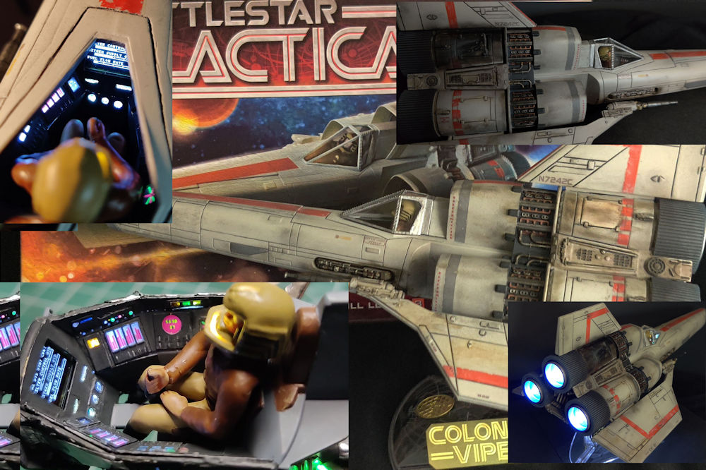
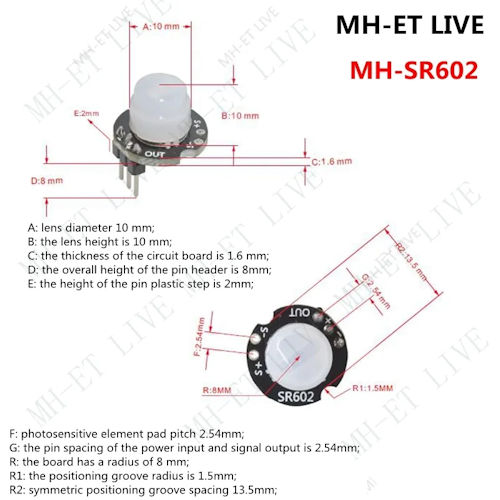
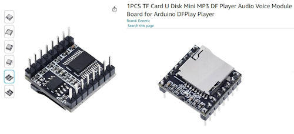
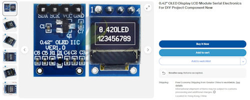

# Battlestar Galactica Classic Viper

Here are the support files for my build of the 1/32nd Battlestar Galactica Classic Viper by Moebius Models. Released to commemorate the 35th Anniversary of the original series.
LED lighting, sound, and an active cockpit display have been added to bring this model to life. 
 
[See My YouTube Channel for more information](https://www.youtube.com/channel/UCbk7sF8TZ_Zz9eOcTYccMCg)

## This build will use the following components in the design:

**SR602 Motion Sensor**

**DF Player Mini**

Sound SD Card
Audio Play List (mp3 folder)
mp3
-	0001_BSG theme song.mp3
-	0002_Viper launch sequence.mp3
-	0003_BSG theme song clip.mp3
-	0004_target aquired.mp3
-	0005_target hit.mp3
-	0006_guns.mp3

**0.42" OLED Display**

Uses an SSD1306 display controller

## Directories
- src: Contains Arduino sketch files
- lib: Associated Arduino libraries
- schematics: Images of the schematic design
- doc: Build documents 
- img: Images for this document

